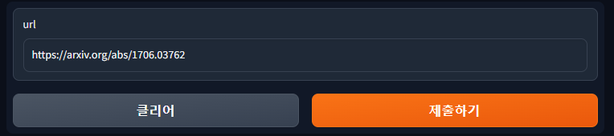
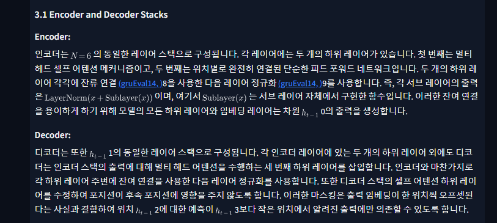

# arxiv-translator

arxiv Translator

## TODO

- [ ] Function Parser
- [ ] Table Parser
- [ ] Image Parser
- [ ] HTMLParser to Asyncy
- [ ] Translator to Asyncy
- [ ] Add Free Translator
- [ ] Arxiv Crawler
- [ ] Save Option (image, markdown)

## Installation

```bash
pip install requirements.txt
```


## Demo

1. make config file

api-keys.yaml
```yaml
deepl: xxx-xxx-xx
```

2. run gradio
```bash
python run.py
```

3. run cli
```bash
python run.py --url ${arxivURL} --cli
```

## Results



